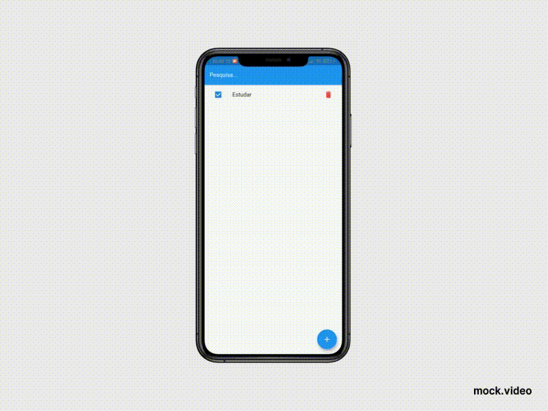

# ToDo List MobX
⭐ This is a ToDo List app developed in Flutter, using object oriented programing and **MobX** ⭐ 

## The Game



## Configuration Steps

Cloning the repository:
```
$ git clone https://github.com/williamtdepaula/flutter_todo_mobx
```

Open the project:
```
$ cd todo_list_mobx
```

Now run the app on your connected device (using terminal):
```
$ flutter run
```

## 🤓 Author(s)

**William Tristão de Paula**  [Profile](https://github.com/williamtdepaula "GitHub Profile")
